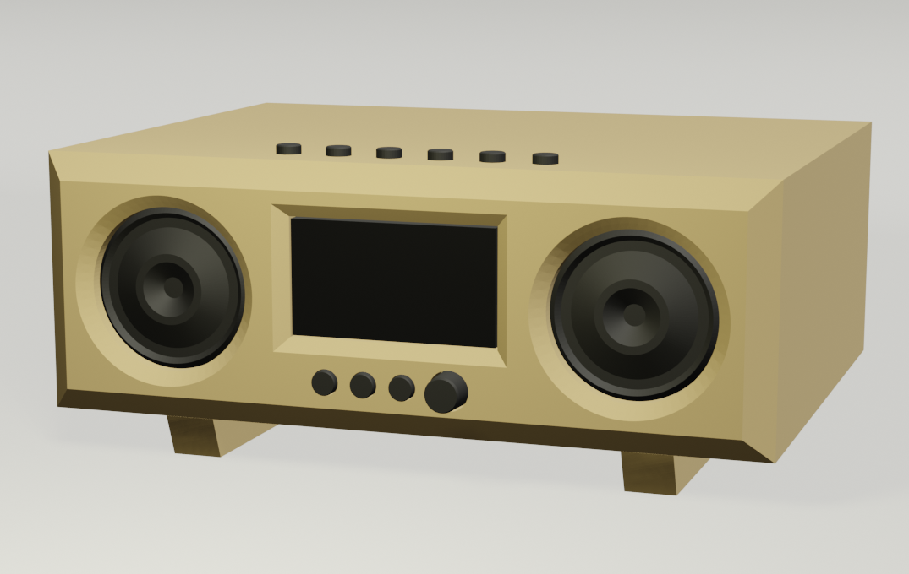
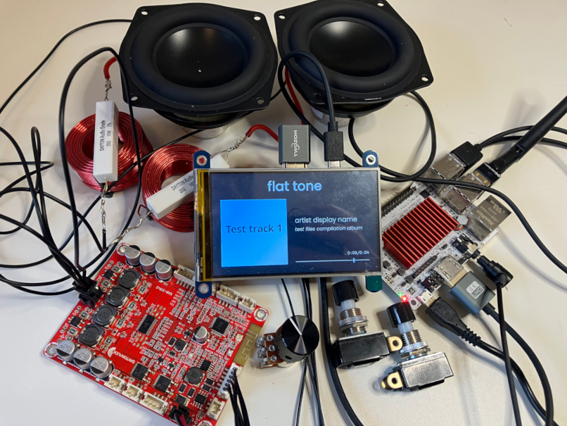

### The Potato Player

Bespoke MP3-player-like speaker project. Start playing from a playlist with the press of a single button. Display the currently playing song, album art, and song progress on miniature HDMI screen.

This is an (unfinished) exploratory project in making a dedicated speaker system that is pre-loaded with several playlists. This is ran on a raspberry pi-like SBC, LibreComputer's Le Potato (AML-S905X-CC), but should be able to be ran on any Linux SBC with GPIO inputs, audio output, and X-capable graphical output. 

Playlists are stored in the `playlists` directory and defined through json and list tracks (or directories, which recursively includes all tracks in that directory) from the `tracks` directory. 

Screen rendering is done using OpenGL ES 2.0, as that is what is supported by the Le Potato. I recommend the "OpenGL Es 2.0 Programming Guide" book (ISBN 9780321502797) if you, like me, can't find good online resources for the older spec. The display shows the track title, artist, and album name, along with the album art and a progress bar and playback timestamp.

This project (currently) only renders text using fonts found in the `fonts` directory, which I will not be redistributing through this repo, so manually acquiring the needed fonts is left as an exercise to the reader.

This project was developed with no knowledge of what goes into making a good sounding speaker, so the speaker components and body were chosen to closely follow Paul Carmody's Sprite Speaker https://sites.google.com/site/undefinition/portable-and-tabletop-speakers/sprite

Design concept of complete project:

The buttons on top are the playlist selection buttons, bottom buttons are skip back, play/pause, skip forward, with volume knob on far right. LHD of the speaker box outer dimensions are 14 x 5 x 11 inches, set on 1 inch high feet.

Physical Implementation thus far:

Speakers have been wired up, buttons and volume potentiometer (shown below screen) have been tested but not yet soldered in. Currently the screen is powered by usb through the Le Potato board, but eventual plan is to have it powered from a wall socket behind a transistor controlled by the software through GPIO to turn the screen on and off. Unfortunately this screen seems to react poorly to that sort of power cycling so further work is necessary there. Wooden speaker cabinet structure has been started but is still in early milling stages.

#### Hardware:
- SBC: Le Potato AML-S905X-CC
- Screen: Waveshare 4 inch HDMI LCD 800x480 Resolution IPS Display Resistive Touch Screen
- Speakers: Dayton Audio ND90-8 3-1/2" Aluminum Cone Full-Range Neo Driver 8 Ohm 
- Amp: Dayton Audio KAB-215v2 2 x 15W Class D Audio Amplifier Board with Bluetooth 5.0 
- Contour filter: Dayton Audio 0.90mH 18 AWG Perfect Layer Inductor Crossover Coil and Dayton Audio DNR-20 20 Ohm 10W Precision Audio Grade Resistor
- Buttons: SB221NO NKK Pushbutton Switches
- Volume potentiometer: Love My Switches Dual-Gang-A250K and Solid Aluminum Knob - "The Eagle" - Black (19mm OD)